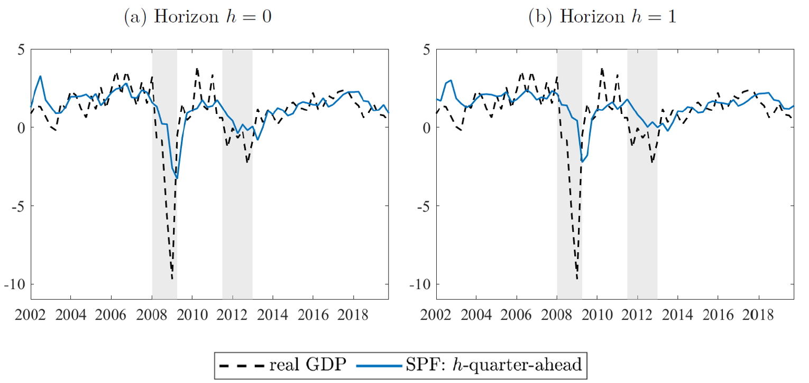

**Work in Progress**

---

<!--more-->

This paper recovers quarterly fixed-horizon forecasts of GDP growth from annual fixed-event projections in the European Central Bank (ECB) Survey of Professional Forecasters (SPF). Based on an approximation of annual projections by quarterly growth rates, we use a Kalman filter and smoother to obtain SPF-consistent forecasts of quarterly GDP growth. Using real-time GDP data, we apply this approach at both the consensus and individual level, resulting in a cross-section of implied forecasts without look-ahead bias. The implied consensus forecasts outperform standard time-series benchmarks at short horizons of up to around three quarters ahead, but appear uninformative at longer horizons. Consistent with earlier findings, the implied consensus forecasts exhibit underreaction, while the individual SPF-consistent forecasts show signs of overreaction.

---

<strong>Implied quarterly SPF forecasts</strong>

