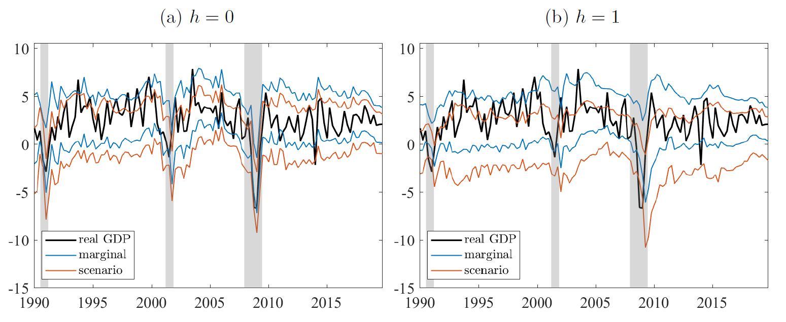

**Working Paper — submitted, under review**

---

<!--more-->

This paper proposes forecasting joint tail risks for key macroeconomic indicators, GDP growth, inflation, and unemployment, using the US Survey of Professional Forecasters (SPF). By incorporating SPF consensus forecasts into the conditional mean of AR-GARCH-type models, the accuracy of univariate and multivariate predictive densities is significantly improved. Modeling a constant correlation matrix captures strong dependencies, particularly between GDP growth and unemployment. Using US data from 1990 to 2024, we show that the joint modeling framework enables scenario-based analysis in which predictive densities, conditioned on adverse developments in other variables, differ substantially from the baseline marginal distributions. The framework allows for a formal out-of-sample evaluation of joint predictive densities and a transparent assessment of conditional tail risks.

**[Download on SSRN →](https://papers.ssrn.com/sol3/papers.cfm?abstract_id=6627819)**

---

<strong>Scenario Density for GDP Growth</strong>

