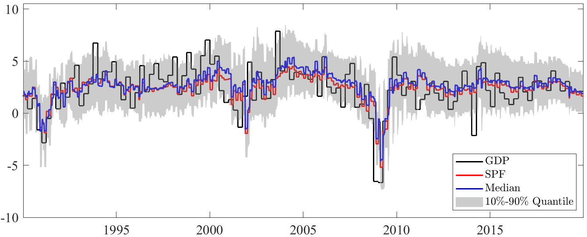

**Job Market Paper — submitted, under review**

---

<!--more-->

This paper investigates nowcasting Growth-at-Risk (GaR) using consensus forecasts from the Survey of Professional Forecasters (SPF) in the US. Incorporating SPF consensus forecasts into the conditional mean of an AR-GARCH-type model significantly enhances nowcasting accuracy for GaR and the conditional density of GDP growth. Using US data from 1990 to 2024, the findings reveal strong time variation in both the lower and upper quantiles of the GDP growth distribution, underscoring the value of SPF consensus projections for real-time monitoring of tail risks to economic growth.

**[Download on SSRN →](https://papers.ssrn.com/sol3/papers.cfm?abstract_id=4859937)**

<strong>Real-Time Density Nowcast for GDP Growth</strong>

Explore the results interactively with the **[Growth-at-Risk Density Forecast Tool](https://manuelschick.shinyapps.io/app-1/)**, which allows you to visualize density forecasts across adjustable quantiles and time periods.